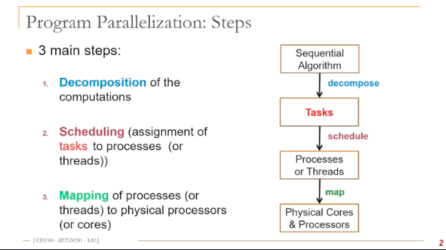
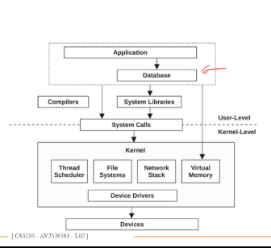
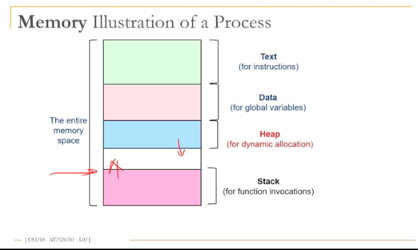

- [L2 Processes, threads and synchronisation](#l2-processes-threads-and-synchronisation)
  - [parallelisation steps](#parallelisation-steps)
  - [processes](#processes)
  - [create a new process in unix](#create-a-new-process-in-unix)
  - [why fork](#why-fork)
  - [inter process communication](#inter-process-communication)
  - [process interaction with OS](#process-interaction-with-os)
  - [disadvantanges of processes](#disadvantanges-of-processes)
- [threads](#threads)
  - [use rlevel threads](#use-rlevel-threads)
  - [kernel threads](#kernel-threads)
  - [mapping of processes to threads](#mapping-of-processes-to-threads)
  - [visiblity of data](#visiblity-of-data)
  - [number of threads / cores](#number-of-threads--cores)
  - [synchronisation](#synchronisation)
  - [shared resources](#shared-resources)

# L2 Processes, threads and synchronisation

## parallelisation steps

- Decomposition of computations -- done by programmer
- Scheduling -- assignment of tasks to processes (or threads) -- done by programmers
- Mapping of processes (or threads) to physical processors (or cores) -- done by the OS and libraries
  - how does it execute on the physical cores? (decided by mapping)
  - OS is the one that schedules them on the cores when theyre available.
    - Most of the time OS does scheduling, but programmer **can** decide which threads run on which cores

- from Application to hardware, need to have several steps
- Applications -> databases -> goes through different system libraries
- For processes to be creayed and operated by OS, need system calls
  - allow us to make processes or threads
- Kernel manages processes or threads and execute them on diff cores
- Programer uses system calls (calling through programms)
  - or libraries can be used to eventually call system cales (indirectly)
- system calls can cause alot of overhead, when you end up often calling them to make processes and threads (to manage all the processes)

## processes

- an instance of a program in execution
- process comprises of
  - executable program (PC)
  - global data
    - OS resources, open files, network connections used by program
  - stack or heap
    - stack for how functions are called
    - heap keep dynamically allocated data of our program
  - keep track of what statements need to be executed by the programs
    - which functions have been called, what is the top of the stack
      - need a bunch of registers to help with that
    - General purpose registers + special purpose registers
- own address space -> exclusive access to its data
  - no other process that can access the virtual space of a process
- need a bunch of registers and information that has to be contained at the OS lvl
- when we execute a program, a process is created
  - OS keeps tracj and manages this process.
    - when the process starts and executes, how long they need to wait for etc
- need to exchange data, or communicate between 2 or more exchange dayta ->> need explicit communication like shared register etc

- OS has to keep track of the memory space

  - a virtual address space of the process
    - placed physically in memory by OS

- multi-programming
  - have more processes than availabl number of cores
  - all cores are busy with other processes,
- switching between processes is done by the scheduler of the OS
- multiple processes can potentially execute at the same time
  - need enough cores for these processes to execute in parallel

context switching: someone has to save the state of the process

- OS has to save the state of the process -- the registers, the virtual address space
  - be placed on the hardware before another process that is going to start executing

overheads:

- creating processes
- system calls
  - save state, etc
- context switch

  - save the current state and replace with another process

- time slicing + parallel execution of processes on diff resources
  - on multiple cores at the same time
  - can happen if you have multiple cores
- even with multiple cores
  - the processes and threads will take turns to execute on the same cores
  - some time-slicing execution of processes on different resources

## create a new process in unix

- fork system call
  - process P1 can create a new process P2. call fork from a process
- P2 is an identical copy of P1 at the time of the fork call
  - address space is identical
  - new process works on a copy of the address space
  - this copy doesnt happen at fork, but later when one of the processes modifies the address space
  - this copy needs to be executed from time to time
- P2 gets its own process number
  - `ps` or `top` to see the process number

- in P1 fork will return the PID of p2 after the creation of P2
- in P2, fork will return 0
- if we see a return value of fork is 0, we are looking at p2
  - else we are in p1 and can keep track of the child process at p1
- fork has a lot of overheads

  - creating a new process, etc bring in alot of overhead

- new process => ready state, process is waiting to be executed
  - goes into running state
  - after its time slice has ended, goes back into ready state
  - while running, the process might do I/O request,
    - which means it will then go to a waiting state
    - after done, itll be in ready state.
  - after done, it is terminated

## why fork

- very useful when the child
  - is cooperating with the parent
  - relies upon the parents data to accomplish its task
  - eg a web server

- more web services were written everyday
- server will wait for connections, accept connections on a socket
- server is waiting for connections, waiting for connections on a socket

  - client will have some requests, need processing of the requests.
    - if this was done in the main process of the server, cannot accept more requests and accept connections at the same time. hence, child processes are needed

- however, now we do not do `int sock = accept();`

  - too many processes = high overhead from context switching, short lived processes (creating and killing the process is expensive)

    - creating too many processes introduces alot of overhead

  - so, what can we do?
    - limit number of processes that can be created
      - a threadpool of processes executing.
        - one process from the pool will be used to accept connection and handle requests by client
        - but because theres no need to create and kill, less overhead.
    - multiplex + listen to multiple requests at the same time
      - receive from multiple sockets at the same time
        - networking system manages keeping down the number of processes

## inter process communication

- need to share info with each other

types

- shared memory
  - need to protect access when reading/writing with locks
- message passing
  - send-receive
    - blocking behaviour: the process that sends waits for the other one to receive
    - synchronous and async
- unix specific
  - pipes and signal

## process interaction with OS

| exceptions                                                                   | interrupts                                                                                 |
| ---------------------------------------------------------------------------- | ------------------------------------------------------------------------------------------ |
| executing a machine level instruction can cause exception, eg. overflow etc. | interrupts the execution of a program. usually hardware related. timer, mouse movement etc |
| synchronous -- occurs due to program execution                               | asynchronous -- independent of a program execution                                         |

## disadvantanges of processes
- crwating a new process is costly
  - overhead of system calls
- management of processes
- communicating between process is costly

> solution: threads

# threads

- an extension of a process
  - a process: multiple independent control flow
    - a thread has a single control flow
  - the thread defines a sequential execution stream within a process
- threads share the address space of the process

- diff control flows = different control floes

- because we dont copy address space, thread generation is faster, can just share address spaces
- different threads of a process can be assigned run on different cores of a multicore processor
- 2 types of threads
  - user-level threads -- created by users
  - kernel threads -- managed by OS (doesnt know how many user level threads of the programs)
- OS only works with kernel threads

whats the difference between kernel threads and processes?
- not much.
- processes are similar to kernel threads.
  - amount of kernel threads overhead is lighter than user level

## use rlevel threads
- manage dby thread library
  - OS is unaware of these threads
  - no OS support
  - OS doesnt know about user level threads
- thread library knows about the thread and decide what to do with them
- advantage: we can switch thread context very fast. -- is not in the kernel space, can switch threads without OS 

disadv: 
- OS cannot map different threads of the same process to different execution resources -- no parallelism
  - OS doesnt know they exist, wil not manage context switching

## kernel threads
- OS is aware they exist, can react corresponsingly, 
- efficient use of cores
- efficient use of cores in a multicore system
  - multiple kernel threads are good for multicore systems

## mapping of processes to threads
- many to one -- all user level are mapped to one process
  - disadv: OS doesnt know they exist, will take turns to run, not in parallel
  - library schedulers are usually much less optimised than OS scheduler
  - multiple threads of the same process are mapped to one kernel thread

- one to one mapping -- each user level thread is assigned to exactly one kernel thread -- no library scheduler needed
  - each user level thread is mapped to one kernel thread
  - OS scheduler can schedule them to execute on the computer
    - because now OS is aware of kernel threads (which map to user level threads)

- many to many mapping -- library scheduler assigns iser level threads to a given set of kernel threads
  - the user-level threads are not called threads in programming langs.
  - people expect one to one mapping for threads
  - many to many are called green threads 
  - green threads can run on a bunch of kernel threads
    - which are usually the number of cores available on the machine.
    - they get multiplexed on these kernel threads. goroutines.
  - a user thread may be mapped to a different kernel thread

## visiblity of data
- global variables of a program and all dynamically alocated data objects can be accessed by any thread of this process
- the function calls for eac hthread are added on the stack
  - each stack needs its own register.
  - each process needs its own thread 
- thread is created and starts executing at Runtime

## number of threads / cores
- not too many, kernel threads too many will be handled by OS
- not too little, need parallelism (make full use of resources)

factors:
- suitable to parallelism degree of application
- suitable to available execution resources
- not be too large to keep low the overhead for thread creation, management and termination small

> ## kernel threads are more like processes
> managed by OS, space managed by OS, context switching managed by OS. difference is that some kernel threads can share address space. 

## synchronisation
- threads cooperate in multithreaded programs
- share resources, access shared data structures
- coordinate their execution
  - one thread executes reletive to another
- scheduling is not under program control
  - use synchronisation to restrict the possible interleaving of threads executions

## shared resources
- coordinating access to shared resources
  - need to work with these shared resources
  - basic problem:
    - 2 concurrent threads are accessing a shared variable + that variable is read / modified / written by those threads, then access to the variable must be controlled to avoid erroneous behaviour
  - mechanisms to control access to shared resources
  - patterns for coordinating accesses to shared resources