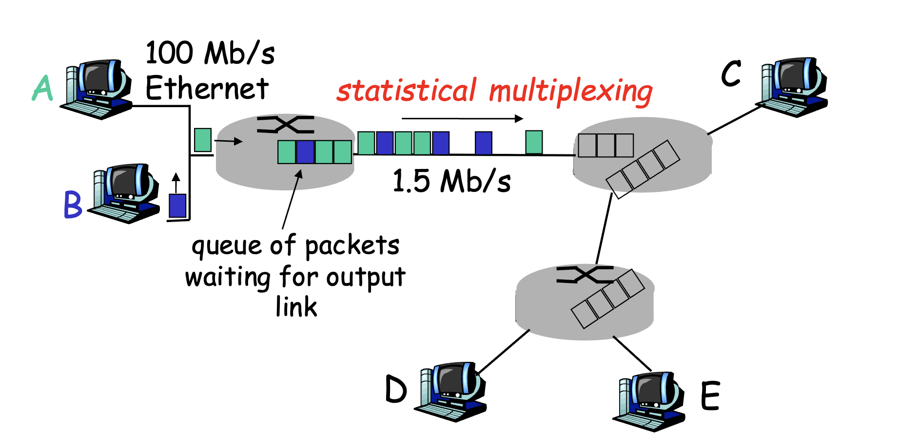
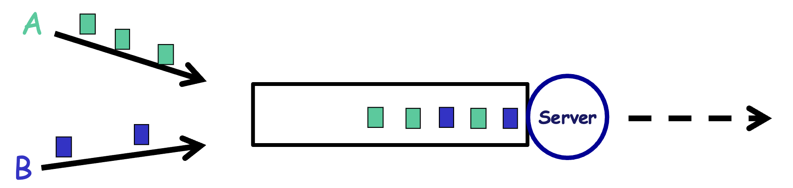
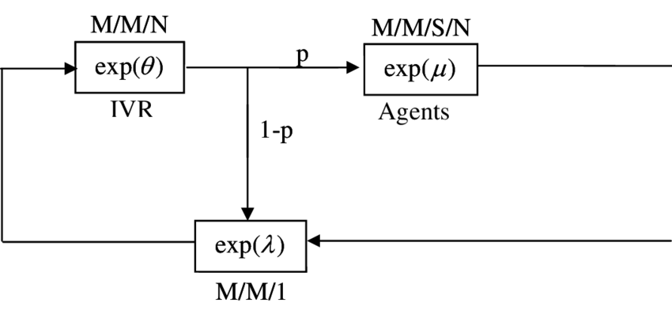

- [admin](#admin)
  - [question mode](#question-mode)
  - [weekly schedule](#weekly-schedule)
  - [assessment](#assessment)
  - [topics of 4226](#topics-of-4226)
  - [plan:](#plan)
- [L1 Network Performance Models](#l1-network-performance-models)
  - [network perf metrics](#network-perf-metrics)
    - [bandwidth (R)](#bandwidth-r)
    - [throughput](#throughput)
    - [delay](#delay)
    - [response time](#response-time)
    - [others](#others)
  - [queueing delay](#queueing-delay)
    - [circuit vs packet switching](#circuit-vs-packet-switching)
  - [queueing model](#queueing-model)
    - [single server queueing model](#single-server-queueing-model)
    - [little's law](#littles-law)
- [L2 Network Queueing Models](#l2-network-queueing-models)
  - [review of last week -- some questions](#review-of-last-week----some-questions)
  - [Packet flow Model: Arrival Pattern](#packet-flow-model-arrival-pattern)
    - [exponential distribution](#exponential-distribution)
    - [poisson process](#poisson-process)
  - [Service Time](#service-time)
- [L3](#l3)
    - [recap](#recap)
  - [Effective bandwidth](#effective-bandwidth)
  - [statistical multiplexing vs tdm](#statistical-multiplexing-vs-tdm)
  - [various queueing models](#various-queueing-models)
  - [burke's theorem](#burkes-theorem)
  - [tandem queues](#tandem-queues)
  - [acyclic network with probabilistic routing](#acyclic-network-with-probabilistic-routing)
  - [jackson network](#jackson-network)
    - [solving jackson network](#solving-jackson-network)

# admin
Richard Ma - Prof
- tbma@comp.nus.edu.sg
Tiantong - TA
- tiantong.hu@u.nus.edu

## question mode
- raise questions in class, send emails after class
- arrange individual meetings (email)

## weekly schedule
tutorials released one week before tutorial. (one week after lecture)

## assessment
- written asst - 10%
  - given for free, need to try but no need to stress cos they dont grade (10% for free)
- prog assts - 35% << heavy on this, 50% of the time should be spent on this
- midterm - 20%
- final exam - 35%

## topics of 4226
- Network Archi
  - P2P networks
- Internet Ecosystem
  - InterDomain routing - BGP
  - Business and Economics 
- Network Management Paradigm
  - Software-Defined Networking (SDN)
- Network Performance (heavier on this part, more techniques + will test more in finals)
  - Modeling
  - Understand resource allocation, how it can affect performance

## plan: 
❑ Aug 15 - Logistics, Performance Metrics
❑ Aug 22 - Probability and Queueing Model
❑ Aug 29 - M/M/1 Model and Analysis
❑ Sep 5 - Queueing Networks
❑ Sep 12 - Network Resource Allocation
❑ Sep 19 - Introduction to SDN
❑ Sep 26 - Recess
❑ Oct 3 - Mid-term Exam (MPSH 5)
❑ Oct 10 - Software Defined Networking
❑ Oct 17 - Inter-Domain Routing Protocol
❑ Oct 24 - BGP Routing Policy
❑ Oct 31 - Internet Exchange Point
❑ Nov 7 - Peer-to-Peer Networks
❑ Nov 14 - Wrap-Up
❑ Nov 28 - Final Examo

# L1 Network Performance Models

## network perf metrics

### bandwidth (R)
- *R* = Link rate, Bandwidth, Capacity are interchangeable
  - unit: 
    - cable - 1~100Mbps, Fiber optics - 1~`0 Gbps
    - Ethernet - 3Mbps to 100Gbps
    - How many bits can be "pushed" **onto** a link per unit time - subtle difference from throughput
      - not across a link
  - related to **transmission delay**

### throughput
- Throughput of a **UDP/TCP flow** - how many bits can be **communicated** per unit time.
- a source and dest - throughput is e2e, after it goes through different routing paths.
  - how many bits can be sent through the entire flow. 
- related to propagation

### delay
- E2E delay: processing + queuing + transmission + propagation delay
- store and forward paradigm: nodes store bits and form packets before forwarding to the next node

### response time
- E2E delay x 2 (total time to respond)
- S to Dest and Dest to S may take very different routing paths (different E2E time)
  - hence need network perf analysis to estimate

### others
- dropping probability
  - the probability of packets being dropped
- utilisation
  - % of time the cpu is busy (not idle)

> [!NOTE]
> - Throughput: e2e
> - Link rate: the local point - at each link, how many bits per second can be pushed onto the link
>
> analogy:
> 
> Imagine moving house:
> - transmission delay: time to load the truck 
> - propagation delay: the time for the truck to move (transport the items)

## queueing delay

Origin of queueing delay: statistical multiplexing
- this multiplexing is where bandwidth is shared with hosts based on their demand
- input rate > output rate, queueing occurs.
  - packets wait for the output link
- TDM: time division multiplexing
  - time divided to slots for host A and B to use the same link

### circuit vs packet switching
- circuit switching: link is reserved for the users (landline phone)
- packet switching / statistical multiplexing: shared link

analogy of a restaurant
- circuit switching: reserved appointments (reservations only)
  - people might not show up - waste resources 
  - or cancel last minute, new requests might be rejected for nothing
  - hence: high 
- packet switching: queue 
  - if there's alot of people need to queue very long

> Eg. 
> - 1 Mb/s link
> - Each user: 
>   - 100kb/s when "active"
>   - active 10% of the time.
>
> Circuit switching: only 10 users, each take 10%
>
> Packet switching: at 35 users, P(X>10) < 0.0004 where X is the number of users that are active
>
> ?? how to come to this calc - binomial?

**packet switchinng**
- good for bursty data (fluctuating traffic)
- but: excessive congestion (input rate is too high)
  - this leads to ***queueing delay***
  
**circuit switching**
- good for traffic that is consistently high

## queueing model

### single server queueing model

- **modelled as** a server at the end of the queue (like a cashier at the end of a queue)
  - (but in reality it is the link)

### little's law
*L = r x t*

- **L** = Average number of customers in the system (**length of the queue**)
- **r** = **arrival rate** (input rate)
- **t** = average sojourn time (waiting/queueing time - **time they stay in the system**)

formally it is L = ƛW where ƛ is r, W is t

> to think about:
>
> A server with infinite queue and a capacity of 1.5Mb/s, can we predict / guess the queueing delay

# L2 Network Queueing Models

## review of last week -- some questions
- What is the origin of queueing delay
  - alot of the performance degregation comes from queueing delay
- What is the origin of queueing delay
  - infront of output ports there will naturally be a queue for packets
- Little's law

- Single server queueing model
  - we have a queue which can accommodate some customers. (much like a cashier at the start of the queue, just that the end of the queue is the link)
  - If the avg queue length is 5 packets, on average 100 packets arrive per second, what is the avg queueing delay for packet
    - L = 5
    - r = 100
    - t = L/r = 1/20
> What about link capacity (bandwidth)? doesnt it affect queueing delay too?

## Packet flow Model: Arrival Pattern

- Track arrival times? -> ti
  - can be very tedious to track, cannot really tell a pattern
- What about inter-arrival times (intervals between each ti) -> Ti
  - drawback: Ti alone doesnt allow us to derive arrival times
  
  - solution: knowing t1 will let us derive t2, t3 based on T1, T2
  

- Model the inter-arrival times Tis by independent and identically distributed (i.i.d.) random variable (r.v.) T
  - each Ti is independent (P and Stats)
  - identically distributed:
    - each Ti follows the same distribution 
    - for modelling
  - each Ti is a random variable

- ti-s are like bus arrivals and departure times (assuming 0 time to board / alight)
  - finding the time between each arrival is Ti

> Consider a random experiment whose outcome cannot be determined in advance
> - Sample space S: the set of all outcomes (head / tail)
> - Event E: a subset of the sample space
>   - an event is occurred if the outcome s is in E
> - Probability function P(E)
>   - [0, 1]
>   - P(S) = 1 (probability of the entire sample space -- by normalising the probability)
>   - P(E1 and E2) = P(E1) + P(E2) where E1 and E2 are mutex
>   

***What is a random variable***
- A random variable X is a function that assigns a real value to each outcome s ∊ S
  - this is a function -- a mapping (u give me something, i map to something else) domain and range
  - there's nothing random about a random variable once the mapping is defined
- eg. gambling
  - throw a coin, if it's a head, i win $1, if it's a tail i lose $1
  - this game is a random variable

- whats the P(X in set A) = something?
  - probability is defined on events, how do we see probability on a mapping?
  - P(X in set A)
  - 
  - the inverse mapping: X^-1(A)
    - which samples will map to the values in A
      - to get a subset, which will become an event which can be a measured probability

- the **distribution function** F or cdf (cumulative distribution function), of the r.v. X is defined on any real number x by 
  - whats the P(X ≤ x) 

- A r.v. is continuous if there exists a probability density function f(x) such that 
  

***Independence***

- Two r.v. are independent if the realisation of one does not affect the probability distribution of the other
  - f(x, y) = fX(x) * fY(x)
- expectation or mean of a random variable X
  - discrete: 
  - continuous: 

***Back to the arrival pattern***
- we only need to focus on the distirbution of the inter-arrival time Ti
- might be difficult because there are many different distributions
- a continuous r.v. T follows / has an exponential distribution with param ƛ > 0, if, for x ≥ 0
  

### exponential distribution
- a continuous r.v. T follows/has an exponential distribution with parameter lambda > 0, if, for x ≥ 0
  

- What is the unit and physical meaning of lambda?
- T => inter-arrival time.
  - E[T] = mean of inter-arrival time
  - 1/lambda = reverse of the mean of the inter-arrival time? --> frequency / rate at which a packet comes
    - Arrival Rate
    - Measures how fast packet comes in
  - > mean of inter-arrival time is arrival rate 
- Why is exponential a good distribution?

**Properties**
- Memoryless property: P{T > s + t | T > s} = P{T > t}
  - Reads: if T follows an exponential dist, given any t, this above will hold. (what is s?)

- prior history will not affect waiting time towards the future

- the blue curve is very exponential, the inter-arrival times are all smaller at the start

### poisson process

- what is process? 
  - something that goes along the time
  - the whole thing is random, probabilistic, 
- what is poisson?
  - links with poisson distribution (but we will not touch in this course)
  - i give a period of time (1 hours), how many packets will arrive, thats the poisson process?

- each inter-arrival time is the same exponential
  - exponentially distributed as T with rate lambda
  - this arrival pattern is called a poisson process
- why is poisson a good model?
  - starting time doesn't matter (memoryless property)
    - the t1 doesnt matter
      - can look at from any point and look forward

**- merging property:**
- imagine we have 2 traffic flows: tcp and udp
  - each have different arrival rates. if we model both as poisson, (assuming expo. dist.), we can merge both, the combined traffic is also exponential

> this will be seen in tutorials!

## Service Time

- we've modeled the arrival time, now what about the service time?
  - some packets might be bigger or smaller, whats the implication? -- might take different amount of time to process
    - the same packet given different link capacity / rate
    - packets with different lengths under a fixed link
- packet size will affect transmission time.
- service time can be different depending on which link, depending on size of packets: L/r = transmission time

- service time Si -- processing time of packet i under a **fixed** link rate
- service time will be random, but we assume it follows the same distribution
- ave S = E[S] = 1/µ

- service time: in terms of 3103: it is the transmission delay -- the time needed to put the packet on the link
  - they mean the same thing here
- what is the physical meaning of µ in this: *E[S] = 1/µ*
  - Rate of leaving / transmission == packets per unit time LEAVING the queue

# L3

### recap
- what is a **poisson process**
  - T (inter-arrival time) follows an exponential distribution
- what is the **memoryless property**
  - for arrival time
    - intuitively: the P(T - s > x | x > s) = P(T > s + x | T > s)
    - = P(T > x)

  - for service time
    - memoryless property means that no matter how much time has elapsed we can get the service time needed to complete the service (if the distribution is exponential)

- what is **merging property**
  - T(merged) = min(T1, T2), T(merged) is exponentially distributed with mean 1/lambda1 + lambda2

- combining merging and memoryless property
  - the birth-death process, can be modelled as 2 exponential distributions (service time and inter-arrival time) that are merged together

**is M/M/1 a good model**
- does real internet traffic follow poisson process
  - nonstationary poisson process (the distribution is still exponential but the rates may differ (peak period))
  - no for individual traffic flows: depends on application protocol (eg. tcp sliding window sends packet after packet then waits -- nonexponential)
- does service time dollows exponential
  - prob no, TCP packets have a max size
  - maybe yes, for processing time of certain services

- what is the relationship between queueing delay and throughput?
  - positively correlated? based on the monotonic graph ?? -- look at the slides w E[L] against rho and E[W] against rho

## Effective bandwidth
- the physical link capacity
  - upper limit of how much they can transmit (eg. 10Mbps cable)
- effective bandwidth of a link
  - the actual throughput that can be achieved
  - also depends on the quality of service achieved

- they dont want to under use the link, but dont want to use until above a certain upper bound (the max bandwidth we can accommodate)

## statistical multiplexing vs tdm
- statistical: walk in restaurants
  - throughput is µ
- tdm: reservations only
  - throughput is µ / 2

which is better?
  - allocate each poisson stream its own queue with a reduced arrival and service time (lower lambda, lower miu) 
  - or a single queue (lambda, miu)
ans:
- rho = ƛ / µ, which means each of the smaller queues in tdm have the same utilisation (lambda / 2) / (miu / 2)
- if we make reservations, some of the resources will be wasted with a certain prob: E[W] = 1/miu, which is now halved. W inc, each service time increases

E[Q] = k times larger for tdm versus statistical multiplexing

## various queueing models
- multiple servers
  - M/M/n, where n is number of servers
- limited queue size (we now assume it is infinite)
  - M/M/1/K where K is the queue length
  - K is max number of customer, after which packets will be dropped
- Different service disciplines
  - M/M/1/LIFO -- where queue is replaced w a stack
- general service and inter-arrival times
  - service times: M/G/1, M/D/1 -- D = degenerated distribution (constant service time, every customer spend the same time)
  - arrival times: G/M/1
  - both: G/G/1 -- any distribution for both
    - but the more general, cannot write results cleanly (no closed form solutions)

## burke's theorem
- if an M/M/1 system with arival rate lambda starts in a steady state
  - the departure is also poisson with rate lambda (when stable)
  - inter-departure time is exponential as well
  - the number of customers in the system is independent of the sequence of departure times prior to time t
- implication of this theorem: we can confirm that the arrival to the second system will be poisson distribution
  - means the previous system doesnt matter 

## tandem queues
- i dint listen

## acyclic network with probabilistic routing
- different flows might take different paths (after departing from one server)
- each llink is shared by different flows
- if P(goes to route i) = alpha. P(goes to route k) = 1 - alpha
  - and the arrival rates to i and k are still poisson distribution

## jackson network
- there's a loop back

### solving jackson network
- discuss in next lecture

  
